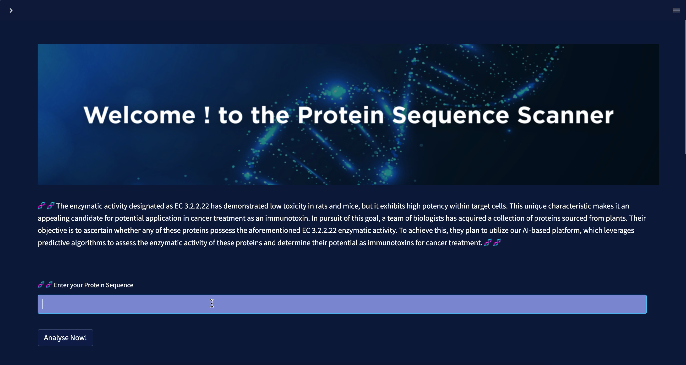

# Protien-Annotation-Project-MajestEYExDjezzy

Cancer is a devastating disease that affects countless individuals worldwide. While chemotherapy has been a common and effective treatment approach, it often comes with unwanted side effects such as hair loss and fatigue.

In order to mitigate these side effects, researchers are diligently working towards discovering improved treatments. They have begun by extracting specific proteins and investigating whether they exhibit glycosylase activity. Identifying proteins with this activity could potentially lead to better cancer treatments with reduced side effects.

To aid in this research, PredEC, an advanced tool, has been developed. Researchers can easily input their shortlisted protein sequence of interest into PredEc for rapid and accurate predictions regarding its enzymatic activity. The tool focuses specifically on the EC 3.2.2.22 activity, which is glycosylase-related. Furthermore, researchers can explore additional information about the protein sequence and visualize the precision of the AI model behind the predictive analysis to validate the results.

By leveraging PredEC, researchers can expedite their investigation process and make informed decisions based on the precise predictions provided by the tool. This project aims to contribute to the development of improved cancer treatments while minimizing the associated side effects.

Using PredEC you can:
- Input Protein Sequence: Start by obtaining the protein sequence of interest that you want to analyze for enzymatic activity.
- Enter Protein Sequence and Initiate Prediction: Input the obtained protein sequence into the PredEC tool. There may be a designated field  where you can paste or enter the sequence.
- Analyze Predictions: Once the prediction process is complete, review the results provided by PredEC. It will rapidly generate predictions regarding the enzymatic activity of the protein sequence.
- Focus on Glycosylase Activity: Pay particular attention to the predictions related to the glycosylase activity (EC 3.2.2.22). These predictions can guide you in identifying proteins that exhibit this specific activity.
- Explore Additional Information: Take advantage of any supplementary information or data offered by the PredEC tool. This may include details about the protein sequence, functional annotations, or related resources.
- Visualize AI Model Precision: utilize the visualization capabilities of PredEC to assess the precision and accuracy of the AI model behind the predictive analysis. This step can help validate the reliability of the results obtained.

